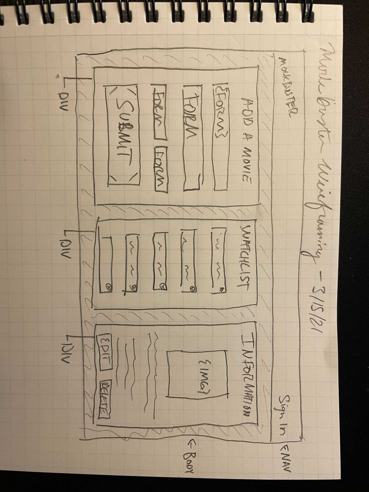

```
PROJECT 3 (Groups): General Assembly Software Engineering Immersive 1-19
```


## Problem

Too many streaming services, movies/series to watch, no way to optimize what you watch and when!

## Application Idea 

The Watchlist: "Your personal inventory of Video entertainment programs to reserve until you are ready to view them with your favorite snacks!!"

## Mockbuster

Time is an extremely important competitive priority for Mockbuster, especially regarding our customers. That is why with our NEW "Total Access" Plan, subscribers will have even more options for their digital rentals like expirations via keys (coming soon!) so waiting for things to disappear is a thing of the past. 

## Usage

 - Visit our website [Mockbuster](https://nameless-peak-75736.herokuapp.com/)
 - Enter a movie into the OMDB API search field or populate the watchlist with movie details, then "Add Movie"
 - View your watchlist, with the ability to add, edit, view (click for more info), or delete

## User stories
 - Our returning and potential users will visit the website or application. 
 - From there they can enjoy having all the information about their favorite video programs displayed at their fingertips. 
 - Once satisfied or unsatisfied, the user has the option to remove the program from their custom inventory by utilizing a removal button.
 - "Total Access" Plan uses a strategy designed with specific keys (see future updates) that will allow the user to set temporary reserves of programs if the account is shared.
 - Potential users can be provided with a free trial of Mockbuster Online (receiviing a free movie rental at the time they agree), or given an informational readMe file. 
 - Users will have their accounts billed every 30-days with 0 late fees. 
 - CANCEL when you want too: 30 days of bespoke video entertainment is at your fingertips!!

- - - -

## Project Schedule

Monday | Tuesday | Wednesday | Thursday 
| :---: | :---: | :---: | :---: 
Setup Back-End Server  | Connect Back-End to React | Complete MVP end of day | Work on Heroku issue
Setup Front-End React Page  | General Functionality | Debug CORS issue | Deploy Heroku
Developers have repository access  | Debug Seed Issue | Start JWT research | Stretch Goals
Peter/rikk setup MVC in Back-End  | Debug React Issue | Debug React issue | Hardcode JWT Auth
Eric setup MVC Front-End w/ CSS  |  | General Functionality | 
Pseudocoding & Wireframing  |  |  | 

- - - - 

## Contributions

<details>
  <summary>Developers</summary>
  <p>
    :bust_in_silhouette: Front-End Developer: Eric Oeur
  </p>
  <p>
    :busts_in_silhouette: Back-End Developer(s): Peter Caufield, Robert 'rikk'
  </p>
</details>

<details>
  <summary>Coding Structure</summary>
  <p>
    React, Node.JS, Express, MongoDB, Mongoose
  </p>
</details>

<details>
  <summary>External Sources</summary>
  <p>
    :exclamation:Phil Winchester, Ben Manning, John Jacobs, & Ron Myers:exclamation:
  </p>
</details>


## Wireframe



## Contributions
- Rikk: CRUD routes for Movies Controller & test data for debugging, JWT functionality
- Peter: Framework for future authorization, Git reconfiguration, and deployment to Heroku/Mongo
- Eric: 

## Future Updates
- Authorization via Sign up and Login buttons
- Keys that are specific to the user
  
## Mission Statement
 
 ```
 Become the global leader in rentable home entertainment
 ```

